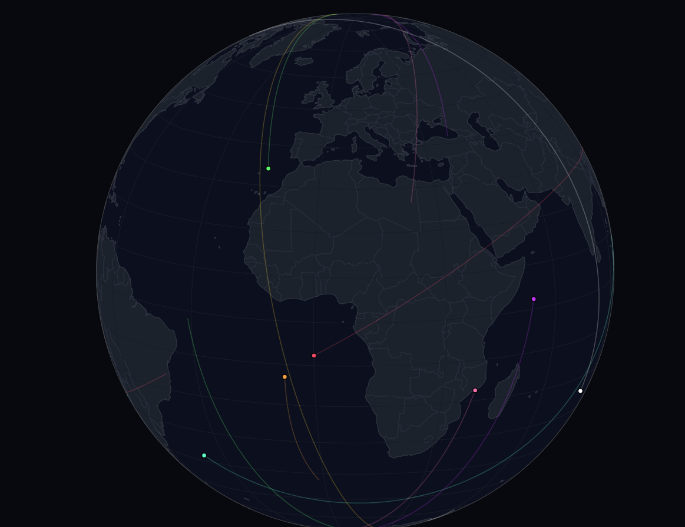

# Visualizador de Cartografía y predicción Orbital TLE Sencillo


> Motor de propagación orbital y renderizado 3D en tiempo real utilizando parámetros TLE del Comando Espacial de EE. UU.



## Sobre el Proyecto

Breve herramienta para visualizar y predecir orbitas de algunos satélites y la Estación Espacial Internacional

## Características Principales

- **Telemetría en Vivo:** Extracción de datos espaciales crudos a través de la API RESTful de N2YO.
- **Motor de Física `Skyfield`:** Propagación matemática de órbitas proyectando los próximos 90 minutos de trayectoria geocéntrica.
- **Renderizado 3D Interactivo:** Motor gráfico construido sobre Plotly con un HUD oscuro y profesional.
- **Flota Escalable:** Capacidad para rastrear simultáneamente constelaciones de internet (Starlink), estaciones espaciales (ISS), telescopios (Hubble) y satélites de observación de la Tierra.

## Instalación y Configuración

1. **Clona el repositorio**
   ```bash
   git clone [https://github.com/TU_USUARIO/Nexus-Orbital-Tracker.git](https://github.com/TU_USUARIO/Nexus-Orbital-Tracker.git)
   cd Nexus-Orbital-Tracker

2. Instala las dependencias

Bash
pip install -r requirements.txt

3. Configura tus variables de entorno

4. Regístrate en N2YO.com y obtén tu API Key gratuita.

6. Renombra el archivo .env.example a .env.

7. Edita el archivo .env y pega tu clave secreta:

Fragmento de código
N2YO_API_KEY=tu_API_aqui

8. Ejecución del Motor
Una vez configurado, lanza la simulación desde tu terminal:

Bash
python nexus_orbital.py
El script calculará las órbitas en la consola y abrirá automáticamente la interfaz 3D en tu navegador predeterminado.


Creado por [Samuel/SamuelCAat6]
Datos orbitales cortesía de la API de N2YO y el catálogo de USSPACECOM.
